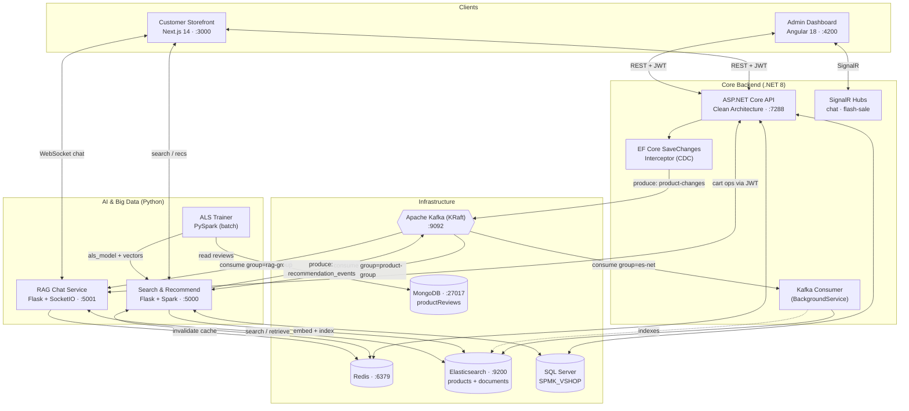
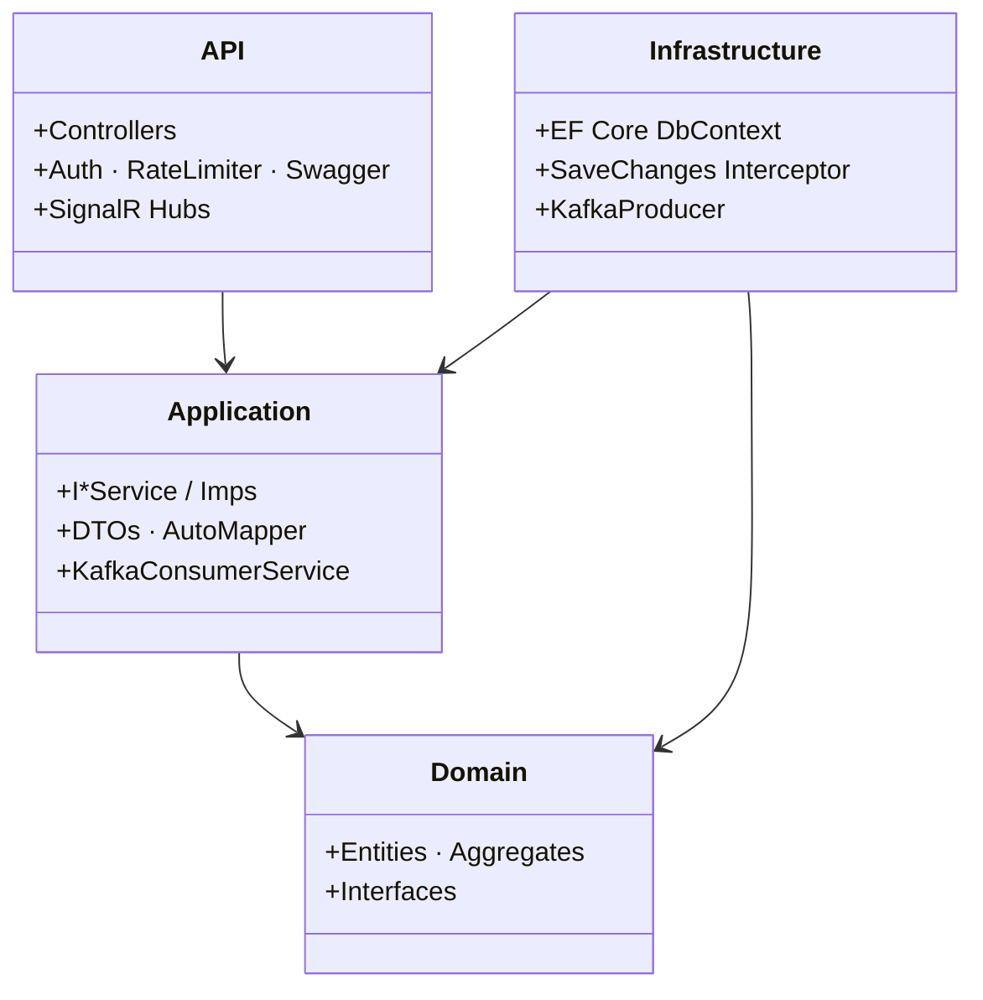
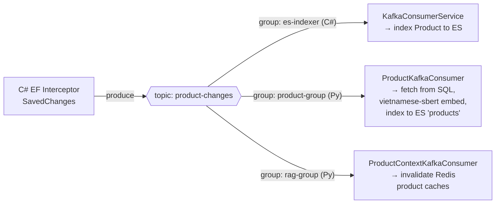
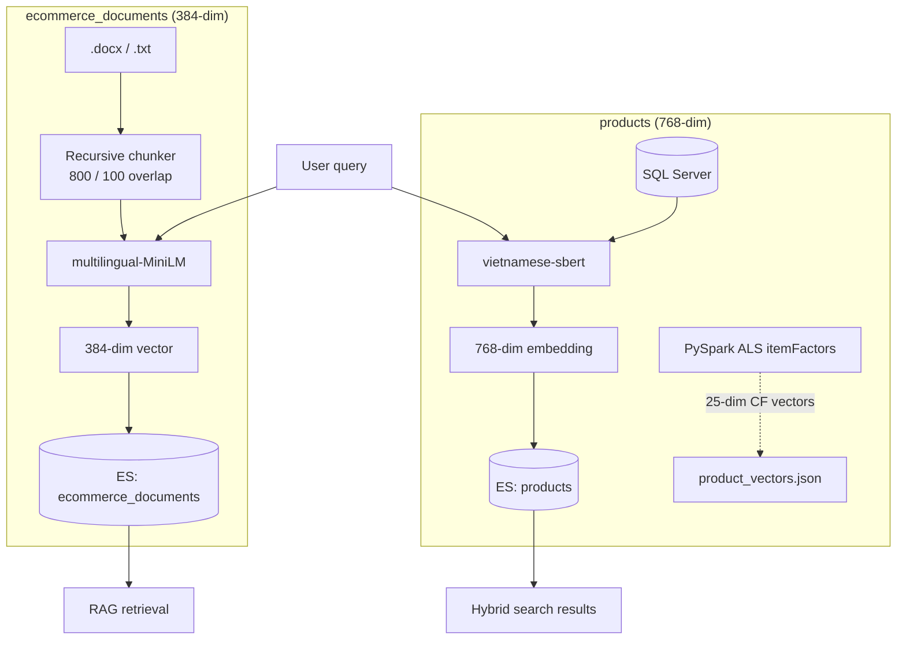
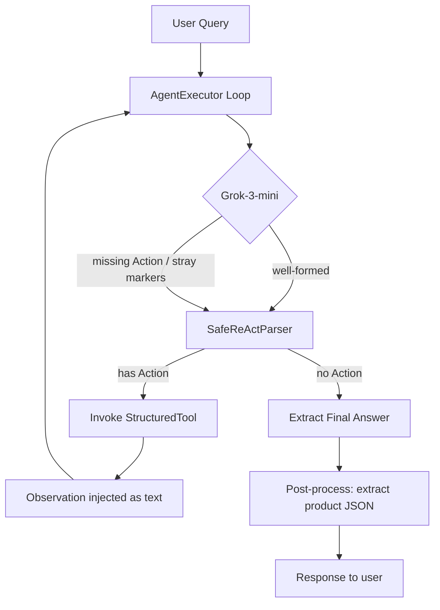
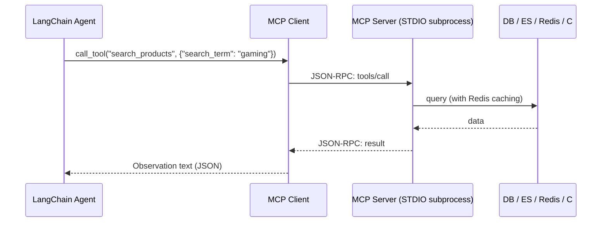
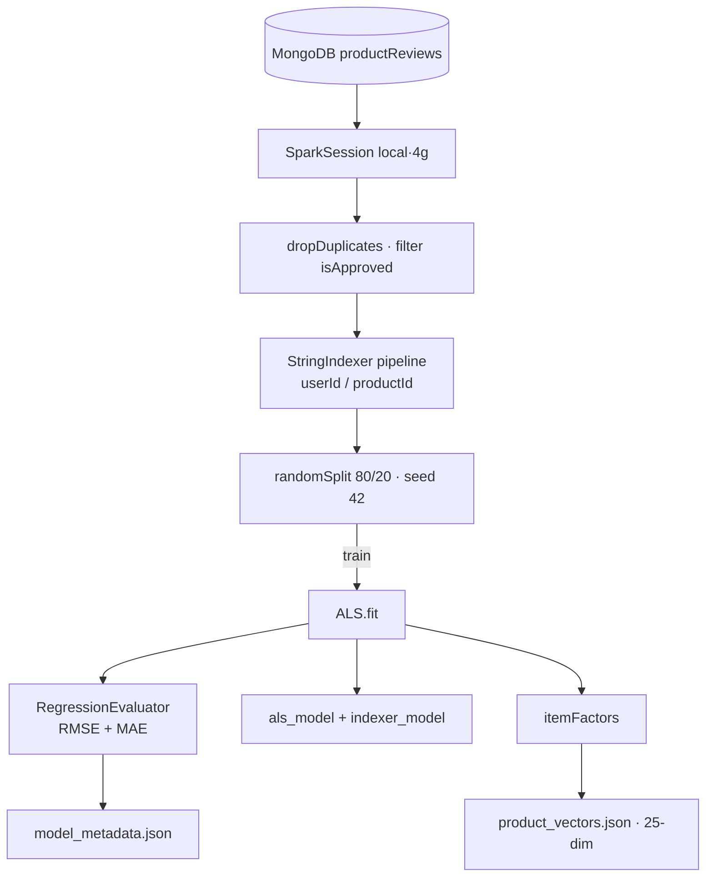

# VShop: Enterprise E-Commerce Platform with RAG & Big Data Analytics

Welcome to the **VShop E-Commerce System**, a fully modernized, highly scalable, and intelligent enterprise e-commerce platform. Designed from the ground up utilizing a **Microservices-inspired architecture**, **Clean Architecture** patterns, **Event-Driven Messaging**, **Big Data Analytics**, and **Generative AI Retrieval-Augmented Generation (RAG)**, this system is engineered to handle massive scale while delivering highly personalized user experiences.

This document serves as the primary entry point for developers, architects, and DevOps engineers looking to understand the project architecture, spin up the environment, and contribute to the codebase.

---

## 🌟 1. Executive Summary & Core Capabilities

VShop is not just a standard web store; it incorporates advanced enterprise techniques:

- **Conversational AI & RAG**: A LangChain **ReAct agent** powered by **Grok-3-mini (via OpenRouter)** acts as a shopping assistant. It reasons, calls tools (product search, document retrieval, cart operations), and answers in Vietnamese. Tools are exposed in **two interchangeable ways**: in-process `StructuredTool`s and **Model Context Protocol (MCP)** servers over JSON-RPC/STDIO.
- **Big Data & Recommendations**: An **Apache Spark (PySpark) ALS** matrix-factorization pipeline trains on review data from MongoDB, and a Flask serving layer fuses **collaborative filtering + Elasticsearch k-NN + Redis trending** into hybrid recommendations.
- **Hybrid Semantic Search**: A single Elasticsearch query blends **BM25 fuzzy full-text** with **dense-vector k-NN** (`vietnamese-sbert`, 768-dim), with an automatic SQL fallback + self-healing re-index.
- **Event-Driven Core**: Apache Kafka (**KRaft mode**, no Zookeeper) decouples services. A single `product-changes` topic is **fanned out to three independent consumers** (C# → ES, Python → ES + embeddings, Python → cache invalidation).
- **Dual Frontends**: An SEO-optimized, i18n-aware **Next.js 14** customer storefront and a **Clean-Architecture Angular 18** admin SPA (PrimeNG, Highcharts, CKEditor 5, SignalR live chat).
- **Clean Architecture Backend**: .NET 8, strictly separating Domain, Application, and Infrastructure, with auto-DI registration, an EF Core **CDC interceptor**, Redis atomic inventory, and VNPay/ZaloPay payments.

---

## 🎯 Engineering Highlights (TL;DR for reviewers)

The parts of this codebase that are genuinely hard — and the reasoning behind them:

| # | What | Why it's interesting |
| :-- | :--- | :--- |
| 1 | **One Kafka topic → three independent consumers** | The EF Core `SavedChanges` interceptor turns every product mutation into a CDC event on `product-changes`. Three consumers with distinct `group.id`s each get *every* event and do different work — C# indexes to ES, Python re-embeds + re-indexes, Python invalidates Redis. A clean illustration of pub/sub fan-out and eventual consistency across a polyglot stack. |
| 2 | **Hybrid search in a single ES query** | `GET /smw-api/product/search` blends **BM25 (boosted, fuzzy)** with **dense-vector k-NN** (`vietnamese-sbert`, 768-dim) in one request, then **self-heals**: on an empty hit it falls back to SQL `LIKE`, embeds the rows, and bulk-indexes them so the index converges over time. Guarded by Redis rate-limiting + result caching. |
| 3 | **Agentic RAG with a hardened ReAct loop** | A LangChain ReAct agent (Grok-3-mini via OpenRouter) calls typed `StructuredTool`s. A custom `SafeReActParser` tolerates malformed LLM output (missing `Action:`, stray markers) so the loop never dead-locks, and a post-processor extracts structured product JSON from intermediate steps for rich UI rendering. Tools are also exposed over **MCP (JSON-RPC/STDIO)** as a decoupled alternative transport. |
| 4 | **Hybrid recommender (CF + content + trending)** | PySpark **ALS** (`rank=25`) learns latent factors from MongoDB reviews; serving fuses ALS `recommendForUserSubset`, **ES k-NN** content similarity (weights 0.6 / 0.4), and **Redis sorted-set** trending — with a cold-start path for anonymous users. |
| 5 | **Clean Architecture on *both* sides** | Not just the .NET backend — the **Angular admin** applies domain/usecases/repositories with a hand-rolled IoC container (`data.ioc.ts`) and dependency inversion. Rare, deliberate, and testable. |
| 6 | **Concurrency-safe flash-sale inventory** | Stock lives in Redis (`inventory:{id}`) and is mutated with atomic `INCR`/`DECR`, eliminating oversell races under high contention; SignalR pushes live flash-sale updates to clients. |

**Stack at a glance:** Next.js 14 · Angular 18 · .NET 8 · Apache Kafka (KRaft) · Apache Spark · Elasticsearch (vector) · Redis · SQL Server · MongoDB · LangChain + MCP · Docker.

---

## 🏗️ 2. High-Level System Architecture

The diagram below shows the runtime topology, including the local service ports and the Kafka fan-out that powers search and AI.



---

## 🧩 3. Subsystem Deep Dive

### 3.1 Customer Portal (`customer-fe`)
- **Technology**: Next.js 14 (App Router), React 18, TypeScript.
- **Internationalization-first routing**: Every route lives under a dynamic `app/[lng]/…` segment. Translations are loaded on the server with `i18next` + `i18next-resources-to-backend` and hydrated to the client with `react-i18next`, so the storefront is multilingual and SEO-friendly out of the box.
- **Route organization**: Uses Next.js *route groups* to separate cross-cutting flows (`(features)/auth`, `(features)/cart`, `(features)/search`) from content pages (`(pages)/product-detail`, `(pages)/category-detail`, `(pages)/combo`, `(pages)/order-history`).
- **State & data fetching**: **Redux Toolkit** (with `redux-logger`) for global UI/cart state, **TanStack React Query** for server-state caching, retries, and synchronization, and **Axios** interceptors that attach the JWT and refresh cookies (`next-client-cookies`).
- **Forms & UX**: `react-hook-form` for validated checkout/auth forms, `framer-motion` + `react-spring` for motion, `react-slick` carousels, `react-paginate` listings, and `react-toastify` notifications. Styling combines **Chakra UI** and **TailwindCSS**.
- **Real-time AI**: The product/search experience can open a WebSocket to the RAG service (`:5001`) for conversational shopping; recommendations come from the Big Data service (`:5000`).
- **Role**: SEO-optimized storefront handling Google OAuth / JWT auth, browsing, cart, combos, checkout, and order history.

### 3.2 Admin Dashboard (`admin-fe`)
The admin panel is an **Angular 18 SPA that applies Clean Architecture on the frontend** — a genuinely uncommon and instructive design.

- **Layered structure** (mirrors the backend):
  - `domain/` — framework-agnostic `entities`, `repositories` (interfaces), `services`, and `usecases` (application business rules).
  - `data/` — `datasources` (remote HTTP / local), `repo-implementations`, `interactors`, typed `requests`/`responses`, and a hand-rolled **IoC container** (`data.ioc.ts`) that wires implementations to domain interfaces (dependency inversion).
  - `core/` — `contracts`, `params`, and shared `types`; plus interceptors, guards, and auth logic.
- **UI toolkit**: **PrimeNG 17**, **TailwindCSS 4**, FontAwesome. Rich-text editing via the full **CKEditor 5** plugin suite (alignment, tables, images, media-embed, paste-from-office…). Interactive analytics via **Highcharts** (+ `highcharts-custom-events`).
- **Real-time**: **`@microsoft/signalr`** client connects to the backend hubs for live customer↔admin chat and flash-sale broadcasts.
- **Feature modules**: `dashboard` (revenue / profit / orders / stock / selling stats), `business` (orders, coupons, promotions, customers, delivery, import-goods, supplier-orders), `master-data` (categories, products, distributors, payment methods), and `system` (roles & permissions, staff, positions).

### 3.3 Core Backend API (`api-be`)
- **Technology**: ASP.NET Core (**.NET 8**), C#, Entity Framework Core, AutoMapper, Confluent.Kafka, StackExchange.Redis, MongoDB.Driver, Elastic.Clients.Elasticsearch, ClosedXML (Excel).
- **Architecture**: Domain-Driven, Clean Architecture with four projects:
  - `Core` (Domain): entities/aggregates (`Product`, `Order`, `Promotion`, `Customer`, `Staff`, `ProductReview`…), value objects, and domain interfaces.
  - `Application`: service contracts (`I*Service`) and implementations (`Imps/`), DTOs, mappers, middleware, SignalR hubs, and Kafka services.
  - `Infrastructure`: `DbContext`, EF interceptors, Kafka producer, external integrations.
  - `api_be.API`: controllers, auth, rate limiting, Swagger, DI composition.
- **Auto DI registration**: Services are decorated with a custom `[RegisterService(ServiceLifetime.Scoped)]` attribute and registered by convention via middleware — no giant `Program.cs` wiring block.



**Notable backend capabilities**

- **Authentication**: JWT Bearer **+ Google OAuth**, with JWT events for cookie/SignalR token extraction.
- **Change-Data-Capture interceptor**: `EntitySaveChangesInterceptor` hooks EF Core's `SavedChanges`. After a `Product` is `Added`/`Modified`/`Deleted` *and the transaction commits*, it publishes a `KafkaMessage<Product>` (with `Operation`) to `product-changes`. It also stamps audit fields and implements **soft delete** (`IsDeleted`) for auditable entities.
- **Atomic inventory in Redis**: `RedisInventoryService` keeps stock counters under `inventory:{productId}` and uses Redis `INCR`/`DECR` for race-free decrements — preventing oversells during flash sales and high concurrency.
- **Real-time hubs**: `ChatHubService` (mapped at `/smw-api/chatHub`) for live support chat and `FlashSaleHubService` broadcasting `ReceiveFlashSaleUpdate` to all clients.
- **Payments**: pluggable `VNPayService` and `ZaloPayService` (config-bound `VNPayConfig` / `ZaloPayConfig`).
- **Rate limiting**: a `FixedWindow` limiter (`LoginRateLimit`) guards auth endpoints.
- **Search & media**: `ProductElasticService` for ES indexing/queries, `AmazonS3Service` for image storage, `ProductExcelService` (ClosedXML) for catalog import/export, plus OTP/SMS/Email services.

### 3.4 Event-Driven Messaging & Caching (Kafka + Redis)

#### 📨 Apache Kafka in KRaft mode
VShop runs a single-broker **Kafka 3.7 in KRaft mode** (`apache/kafka:3.7.0`, no Zookeeper, `:9092`). Two topics carry the system's events:

| Topic | Producer | Payload | Purpose |
| :--- | :--- | :--- | :--- |
| `product-changes` | C# `KafkaProducer<string, KafkaMessage<Product>>` (fired by the EF interceptor) | `{ Operation: Added\|Modified\|Deleted, Data: Product }` | Product CDC → keeps search & caches in sync |
| `recommendation_events` | Python search/recommend service | `{ event_type, user_id, query/product_id, timestamp }` | Behavioral telemetry for analytics & retraining |

**The interesting part — one topic, three consumers.** Because each consumer uses a distinct `group.id`, all of them receive *every* `product-changes` event and react differently:



1. **`KafkaConsumerService`** (C# `BackgroundService`) deserializes the message and indexes/deletes the product in the ES `products` index.
2. **`ProductKafkaConsumer`** (Python, `BigData_training/app.py`, group `product-group`) re-fetches the full product from SQL Server, generates a 768-dim `vietnamese-sbert` embedding, and indexes it to `products` (so semantic search stays fresh), then clears `product:detail:{id}`.
3. **`ProductContextKafkaConsumer`** (Python, `ecommerce-rag`, group `rag-group`) invalidates the RAG-side Redis caches (`products:*`, `product:*`, `rag:product_context`, `categories:all`) so the chatbot never serves stale data.

The C# producer auto-creates the topic on startup (`AdminClient`, 1 partition / RF 1) with `Acks.All` and bounded retries.

#### ⚡ Redis distributed cache
Redis (`:6379`) is used pervasively and for more than caching:
- **Hot-path cache**: product lists, search results (`search:{sha256}:{page}:{size}`, 30-min TTL), categories (1-hour TTL), and the RAG product context (24-hour TTL).
- **Atomic inventory**: `inventory:{id}` counters (see §3.3).
- **Trending sorted sets**: `trending:views`, `trending:purchases`, `trending:likes` (see §5).
- **Rate limiting**: a per-user sorted set (`rate_limit:{user}`) enforces 100 queries/hour on the search API.
- **Token & session storage** for auth.

### 3.5 Elasticsearch — Two Indices, Two Embedding Models
Elasticsearch (`8.11`, `:9200`, security disabled for local dev, Kibana on `:5601`) backs both keyword search and the vector/semantic features. VShop deliberately keeps **two indices with different embedding models**:

| Index | Created by | Vector field | Dims | Model | Used for |
| :--- | :--- | :--- | :--- | :--- | :--- |
| `products` | `BigData_training/app.py` · C# consumer | `embedding` | **768** | `keepitreal/vietnamese-sbert` | Hybrid semantic product search + k-NN "similar products" |
| `ecommerce_documents` | `ecommerce-rag/setup_elasticsearch.py` | `vector` | **384** | `paraphrase-multilingual-MiniLM-L12-v2` | RAG knowledge base (policies, store docs, guides) |



---

## 🤖 4. Generative AI & Retrieval-Augmented Generation (`ecommerce-rag`)

VShop's conversational assistant is a Flask + Flask-SocketIO service (`app.py`, `:5001`) that wraps a **LangChain agent**. Rather than a static Q&A bot, it runs an **agentic ReAct loop** that decides which tools to call, queries live data, manipulates the shopping cart, and retrieves knowledge-base documents — all in Vietnamese.

### 🧠 LLM Orchestration & the ReAct Agent
- **LLM**: **`x-ai/grok-3-mini-beta` via OpenRouter**, wired through LangChain's `ChatOpenAI` with a custom base URL and headers (`HTTP-Referer`, `X-Title`). `temperature=0.2`, `max_tokens=2000`, and a `stop=["Observation:"]` token so the model never hallucinates tool outputs.
- **Agent**: built with `create_react_agent` using the standard `hwchase17/react` prompt pulled from LangChain Hub, **prepended with a Vietnamese system prompt** that codifies tool-routing rules (search → `search_products`, cart → `view_shopping_cart`, policy/store info → `search_documents`).
- **Executor**: `AgentExecutor` with `ConversationBufferMemory` (multi-turn context via `chat_history`), `return_intermediate_steps=True`, `handle_parsing_errors=True`, and `early_stopping_method="force"`.

#### Custom Output Parser — `SafeReActParser`
LLMs frequently break the strict ReAct format (omitting `Action:`, leaking `Thought:`/`Final Answer:` markers). The custom parser makes the loop robust:
1. **No-`Action` fallback** → treat the whole output as a `Final Answer` instead of crashing the loop.
2. **Marker cleanup** → strips trailing `Thought:` / `Final Answer:` fragments before returning text to the user.
3. **Tolerant tool parsing** → extracts `Action` / `Action Input` via regex and `json.loads`-es the arguments, falling back to the raw string when it isn't valid JSON.



#### Response post-processing
After the agent finishes, `RAGService.chat()` walks the **intermediate steps in reverse**, finds the most recent `search_products` / `get_products` observation, regex-extracts the JSON product array, validates it (`name`/`price`/`id` keys), and returns a structured `{ answer, action: "show_products", products: [...] }` payload — so the frontend renders product cards even when the LLM's prose is terse. A keyword check also injects extra recommendations for "gợi ý"/"recommend" queries.

### 🧰 Tool Catalog
Tools live in `services/tools.py` as LangChain `StructuredTool`s (typed via Pydantic schemas like `SearchProductsInput`, `AddToCartInput`). All product/document tools are **Redis-cached**:

| Tool | Backing call | Cache TTL |
| :--- | :--- | :--- |
| `search_products(search_term, limit)` | Hybrid search API `GET /smw-api/product/search` (`:5000`) | 5 min |
| `get_categories()` | SQL Server via `DatabaseService` | 1 hour |
| `get_product_context_for_rag()` | Aggregated SQL product text for grounding | 24 hours |
| `search_documents(query, k)` | `ElasticsearchStore` retriever (`ecommerce_documents`) | — |
| `add_document_to_knowledge_base(file_path, doc_type, description)` | Chunk → embed → index | — |
| `view_shopping_cart` / `add_product_to_cart(product_id, quantity, user_token)` | C# Order API (forwards the user's **JWT**) | — |
| `invalidate_product_cache()` | Bulk Redis key purge | — |

### 🔌 Model Context Protocol (MCP) — the alternative tool transport
The repo ships a **second, decoupled** way to expose the same capabilities: standalone **MCP servers** that run as subprocesses and speak **JSON-RPC 2.0 over STDIO**. `mcp_client.py` launches them and adapts their tools into LangChain via `langchain_mcp_adapters` + `langgraph`'s prebuilt ReAct agent.

- **`product_server.py`** (FastMCP) → `get_products`, `search_products`, `get_product_details`, `get_categories`, `get_products_context`, `invalidate_product_cache` (Redis-cached).
- **`document_server.py`** → `search_documents`, `add_document` (embeds into `ecommerce_documents`).
- **`cart_server.py`** → `add_to_cart`, `get_cart`, `remove_from_cart`, `update_cart_quantity`, `clear_cart` — each forwarding the JWT to the C# Order API.

> **Note on which path is "live":** `app.py` uses the **in-process `StructuredTool`** agent (`RAGService`) by default; the **MCP client/servers** are a parallel implementation demonstrating tool isolation and the MCP standard. Both share `DatabaseService`, `LocalEmbeddings`, and the same Redis/ES backends.



### 📚 Document RAG Ingestion
Admins upload `.docx` / `.txt` files via the `/admin/upload` Flask blueprint. `DocumentProcessor`:
1. Extracts text (paragraphs **and tables** for Word docs).
2. Splits with `RecursiveCharacterTextSplitter` (`chunk_size=800`, `overlap=100`).
3. Embeds each chunk with `paraphrase-multilingual-MiniLM-L12-v2` (384-dim, runs **locally** — no API cost) and writes to the `ecommerce_documents` ES index (`dense_vector`, cosine).

The shipped knowledge base includes the VShop company/policy document used by the assistant to answer store-info questions.

---

## 📈 5. Big Data & Machine Learning Pipeline (`BigData_training`)

This module mines transactional and behavioral data to produce personalized recommendations, trending lists, and the semantic-search backend. It is split into a **batch trainer** (`train_model.py`) and an **online serving API** (`app.py` + `recommendation_service.py`).

### 🗃️ Data Sources
- **MongoDB** `api_be_db.productReviews` — user→product ratings (`isDeleted=false`, `isApproved=true`) for collaborative filtering.
- **SQL Server** `SPMK_VSHOP` — the product/category catalog (source of truth for embeddings & details).
- **`crawl_data.py`** — a **GearVN Shopify-JSON crawler** that seeds realistic retail data.
- **`data_generator.py`** — synthesizes users + reviews (70% regular / 20% active / 10% power reviewers) to give ALS enough signal.

### 📐 Collaborative Filtering — ALS Matrix Factorization (PySpark)
The recommender uses **Alternating Least Squares (ALS)** from `pyspark.ml.recommendation`. Users and items are mapped to a shared latent space of dimension `f = 25`; the predicted rating is the inner product of the user and item factor vectors.

The model minimizes the regularized squared error:

$$ \mathcal{L}(X, Y) = \sum_{(u,i) \in \mathcal{K}} (r_{ui} - x_u^T y_i)^2 + \lambda \left( \sum_u \lVert x_u \rVert^2 + \sum_i \lVert y_i \rVert^2 \right) $$

where $\mathcal{K}$ is the set of observed ratings from MongoDB, and $\lambda$ is `regParam`. VShop trains with `maxIter=10`, `regParam=0.01`, `rank=25`, `coldStartStrategy="drop"`, and `nonnegative=True` (interpretable, non-negative preference components).



**Preprocessing & artifacts**
- **String indexing**: Spark ALS needs integer indices, so a `StringIndexer` `Pipeline` (`handleInvalid='keep'`) maps `userId`/`productId` → indices; the fitted `indexer_model` is saved for reverse mapping at serving time.
- **Evaluation**: `RegressionEvaluator` computes RMSE and MAE on the 20% hold-out; metrics + factor counts are written to `model_metadata.json`.
- **Outputs** (under `models/`): `als_model`, `indexer_model`, `product_vectors.json` (item factors mapped back to real product IDs), and `model_metadata.json`.

### ⚡ Hybrid Serving & Real-Time Inference
`recommendation_service.py` (`HybridRecommendationService`) loads the saved `als_model` + `indexer_model` and exposes several strategies through the Flask API in `app.py`:

```mermaid
flowchart TD
    Req[/smw-api/recommendations/*] --> Route{User status?}
    Route -->|anonymous| Trend[Redis trending]
    Route -->|authenticated| Hybrid[Hybrid resolver]
    Hybrid -->|recommendForUserSubset| Collab[ALS collaborative]
    Hybrid -->|ES k-NN on embedding| Content[Similar products]
    Collab --> Merge[Weighted merge]
    Content --> Merge
    Merge --> Page[promotions + paginate]
```

1. **Collaborative (ALS)** — `get_user_index()` maps the request's `userId` through the indexer, then `als_model.recommendForUserSubset(...)` returns top candidate item indices.
2. **Content-based (ES k-NN)** — `get_similar_products()` reads a product's stored `embedding` and runs a k-NN query (`k`, `num_candidates=50`, `min_score=0.7`) against `products`.
3. **Hybrid merge** — content candidates are weighted **0.6** and collaborative **0.4**, then sorted; results are hydrated with live promotions before pagination.
4. **Trending (Redis sorted sets)** — interactions are tracked without DB locking: `ZINCRBY trending:views 1`, `trending:purchases 3`, `trending:likes 2`. The trending list combines `views·0.3 + purchases·0.7` via `ZREVRANGE` and resolves details from ES.

### 🔍 Hybrid Semantic Search (`GET /smw-api/product/search`)
The flagship search endpoint runs **BM25 + dense-vector k-NN in one Elasticsearch request**:
- **Lexical**: `multi_match` with field boosting (`name^3`, `category.name^2`, `feature^2`, `specifications^2`, `describes^1`) and `fuzziness: AUTO` (typo tolerance).
- **Semantic**: a `vietnamese-sbert` query embedding searched via `knn` over the `embedding` field (`k=20`, `num_candidates=100`).
- **Self-healing fallback**: if ES returns nothing, it queries SQL Server with `LIKE`, **embeds + bulk-indexes** those rows into ES on the fly, then serves them — so the index gradually heals itself.
- **Resilience & speed**: per-user **rate limiting** (100/hour, Redis), result **caching** (`sha256` key, 30-min TTL), live **promotion pricing** (`NewPrice`), and **Kafka logging** of every query to `recommendation_events`. Results are returned in a `.NET`-style `PaginatedResult<ProductDto>` envelope (Pydantic).

### 🕷️ GearVN Shopify JSON Crawler (`crawl_data.py`)
Seeds the catalog with real retail data across 6 top categories (Laptop, Laptop Gaming, PC GVN, Linh Kiện, Ổ cứng & RAM, Ngoại vi) and their sub-collections:
- **Hidden JSON endpoints**: hits `gearvn.com/collections/<slug>/products.json` (and `/products/<handle>.js` for details), avoiding fragile HTML scraping.
- **Variant processing**: reads the first variant for price (cents→VND) and inventory; extracts up to 3 images and `spec_`/`hl_` tags into JSON specifications.
- **Batch SQL generation**: sanitizes strings (escapes quotes, strips HTML, length-caps), builds the category→product hierarchy, and emits a batched `insert_gearvn_data.sql` with `IDENTITY_INSERT` toggles.

### 🪟 Spark-on-Windows note
`app.py` configures `JAVA_HOME` (**JDK 11**), `HADOOP_HOME` (`C:\hadoop` with `winutils.exe`), and runs Spark in `local[*]` mode (4g driver for training, 2g for serving) — required to run PySpark natively on Windows.

---

## 💻 6. Technology Stack Matrix

| Layer | Technologies |
| :--- | :--- |
| **Customer Frontend** | Next.js 14 (App Router), React 18, Redux Toolkit, TanStack React Query, i18next, react-hook-form, Chakra UI, TailwindCSS, Framer Motion |
| **Admin Frontend** | Angular 18 (Clean Architecture), RxJS, PrimeNG 17, Highcharts, CKEditor 5, @microsoft/signalr, TailwindCSS 4 |
| **Backend API** | .NET 8, C#, EF Core, AutoMapper, SignalR, ClosedXML, Clean Architecture, auto-DI |
| **Message Broker** | Apache Kafka 3.7 (KRaft mode) — Confluent.Kafka (C#) / confluent-kafka (Python) |
| **Databases** | SQL Server (catalog/orders) · MongoDB (reviews) |
| **Caching / Realtime State** | Redis (cache, atomic inventory, trending sorted sets, rate limit, tokens) |
| **Search & Vector DB** | Elasticsearch 8.11 (BM25 + dense_vector k-NN), Kibana |
| **Generative AI (RAG)** | Python, LangChain, LangGraph, MCP (FastMCP + langchain-mcp-adapters), Grok-3-mini via OpenRouter, sentence-transformers |
| **Big Data & ML** | Apache Spark / PySpark (ALS), Flask, Pydantic, SQLAlchemy, pymongo |
| **Embeddings** | `keepitreal/vietnamese-sbert` (768) · `paraphrase-multilingual-MiniLM-L12-v2` (384) |
| **Payments / Cloud** | VNPay, ZaloPay, AWS S3 |
| **DevOps & Infra** | Docker, Docker Compose |

---

## 📂 7. Detailed Directory Structure

```text
VShop/
├── admin-fe/                           # Angular 18 Admin SPA (Clean Architecture FE)
│   ├── src/domain/                     # entities · repositories · services · usecases
│   ├── src/data/                       # datasources · interactors · IoC (data.ioc.ts)
│   ├── src/core/                       # contracts · params · types · guards
│   └── src/app/admin/                  # dashboard · business · master-data · system
│
├── api-be/                             # .NET 8 backend + Python AI services
│   ├── api_be/                         # API host: Controllers, Program.cs, DI
│   ├── Application/                    # I*Service / Imps, DTOs, Hubs, KafkaService
│   ├── Core/                           # Domain entities, interfaces, DTOs
│   ├── Infrastructure/                 # EF DbContext, SaveChanges interceptor, KafkaProducer
│   │
│   ├── ecommerce-rag/                  # GenAI RAG service (Flask + SocketIO :5001)
│   │   ├── app.py                      # Chat API + WebSocket + product-sync consumer
│   │   ├── admin.py                    # Document upload / cache-refresh blueprint
│   │   ├── config/config.py            # Central config (ES, Redis, Kafka, C# API)
│   │   ├── services/
│   │   │   ├── rag_service.py          # ReAct agent + SafeReActParser
│   │   │   ├── tools.py                # LangChain StructuredTools (cached)
│   │   │   ├── db_service.py           # SQL Server access
│   │   │   └── product_context_kafka.py# rag-group cache-invalidation consumer
│   │   ├── mcp_client.py               # MCP client (LangGraph ReAct over MCP tools)
│   │   ├── mcp_servers/                # product / document / cart MCP servers (STDIO)
│   │   ├── utils/                      # embeddings.py · document_processor.py
│   │   └── setup_elasticsearch.py      # Creates ecommerce_documents index (384-dim)
│   │
│   ├── BigData_training/               # Spark ML + search/recommend serving
│   │   ├── train_model.py              # ALS training pipeline (PySpark)
│   │   ├── recommendation_service.py   # Hybrid recommender (ALS + ES k-NN + trending)
│   │   ├── app.py                      # Flask :5000 — search, recs, ES indexer, Kafka consumer
│   │   ├── crawl_data.py               # GearVN Shopify-JSON crawler → insert_gearvn_data.sql
│   │   └── data_generator.py           # Synthetic users + reviews
│   │
│   ├── docker-compose.yaml             # Redis, Elasticsearch, Kibana, MongoDB
│   ├── docker-kafka.yaml               # Kafka (KRaft mode)
│   └── insert_gearvn_data.sql          # Generated catalog seed
│
└── customer-fe/                        # Next.js 14 storefront (:3000)
    ├── src/app/[lng]/(features)/       # auth · cart · search
    ├── src/app/[lng]/(pages)/          # product-detail · category-detail · combo · order-history
    ├── src/redux/  · src/configs/      # Redux store · i18n · axios interceptors
    └── package.json
```

---

## 🚀 8. Setup & Installation Guide

### Prerequisites
1. **Node.js** ≥ 18
2. **.NET SDK 8**
3. **Python 3.10+**
4. **Java JDK 11** (required by PySpark) + on Windows, `C:\hadoop\bin\winutils.exe` (`HADOOP_HOME`)
5. **Docker Desktop** (Redis, Elasticsearch, Kibana, MongoDB, Kafka)
6. **SQL Server** instance with the `SPMK_VSHOP` database

### Step 1 — Infrastructure
```bash
cd api-be
docker-compose up -d                    # Redis, Elasticsearch, Kibana, MongoDB
docker-compose -f docker-kafka.yaml up -d   # Kafka (KRaft, no Zookeeper)
docker ps                               # verify containers are healthy
```

### Step 2 — Seed the database
```bash
# Connect via SSMS / sqlcmd to your SQL Server and run:
#   Insert_Sql.sql           (schema + base data)
#   insert_gearvn_data.sql   (crawled catalog)
# Optionally generate reviews:  python BigData_training/data_generator.py
```

### Step 3 — .NET Backend
```bash
cd api-be
dotnet restore
dotnet run --project api_be/api_be.API.csproj
# Swagger: https://localhost:7288/swagger
```

### Step 4 — Big Data / Search service (`:5000`)
```bash
cd api-be/BigData_training
pip install -r requirements.txt
python train_model.py     # trains ALS, writes models/ (run once / on schedule)
python app.py             # search + recommendations + ES indexer + Kafka consumer
```

### Step 5 — RAG Chat service (`:5001`)
```bash
cd api-be/ecommerce-rag
pip install -r requirements.txt
python setup_elasticsearch.py   # creates the ecommerce_documents (384-dim) index
python app.py                   # Flask + SocketIO chat assistant
```

### Step 6 — Frontends
```bash
# Customer (Next.js)              # Admin (Angular)
cd customer-fe                    cd admin-fe
npm install                       npm install
npm run dev   # http://localhost:3000   npm run start  # http://localhost:4200
```

---

## 🔧 9. Environment Configuration

### Frontend
- **Next.js** — `customer-fe/.env.local`: API base URL, Google OAuth keys.
- **Angular** — `admin-fe/src/environments/environment.ts`: API URLs + SignalR hub URL.

### Backend (`appsettings.json`)
- `ConnectionStrings` (SQL Server), `Redis`, `Elasticsearch:Url`, `Kafka:BootstrapServers` / `Kafka:ProductTopic` / `Kafka:GroupId`, `Authentication:Google`, `VNPay`, `ZaloPay`, AWS S3.

### Python services (`.env`)
| Variable | Default | Used by |
| :--- | :--- | :--- |
| `GOOGLE_API_KEY` | — | (optional Gemini path in MCP client) |
| `OpenRouter key` | inline in `rag_service.py` | Grok-3-mini LLM |
| `SQL_SERVER_CONN` | `ODBC Driver 17 …` | catalog access |
| `ELASTICSEARCH_URL` | `http://localhost:9200` | search / RAG |
| `REDIS_HOST/PORT/DB` | `localhost:6379/0` | cache / trending |
| `KAFKA_BROKER` | `localhost:9092` | consumers |
| `KAFKA_TOPIC` | `product-changes` | product CDC |
| `KAFKA_GROUP_ID` | `rag-group` | RAG cache invalidation |
| `CSHARP_API_BASE` | `https://localhost:7288/smw-api` | cart tools |

> ⚠️ **Security**: the repo currently contains hard-coded credentials/keys in some files (SQL passwords, an OpenRouter key in `rag_service.py`, `.env`). Move these to environment variables / secret managers before any non-local deployment, and rotate the exposed keys.

### Service port reference
| Service | Port |
| :--- | :--- |
| Customer (Next.js) | 3000 |
| Admin (Angular) | 4200 |
| .NET API | 7288 (https) |
| Big Data / Search (Flask) | 5000 |
| RAG Chat (Flask + SocketIO) | 5001 |
| Kafka | 9092 |
| Redis | 6379 |
| Elasticsearch / Kibana | 9200 / 5601 |
| MongoDB | 27017 |

---

## 🤝 10. Contributing
1. Branch from `main`: `git checkout -b feature/amazing-feature`.
2. Follow Clean Architecture boundaries (backend **and** the Angular frontend).
3. Keep secrets out of source — use env vars.
4. Add tests for Application-layer services and Domain logic.
5. Push and open a Pull Request.

---

*Architected for scale. Designed for the future of e-commerce.*
*© 2026 VShop Project Team.*
