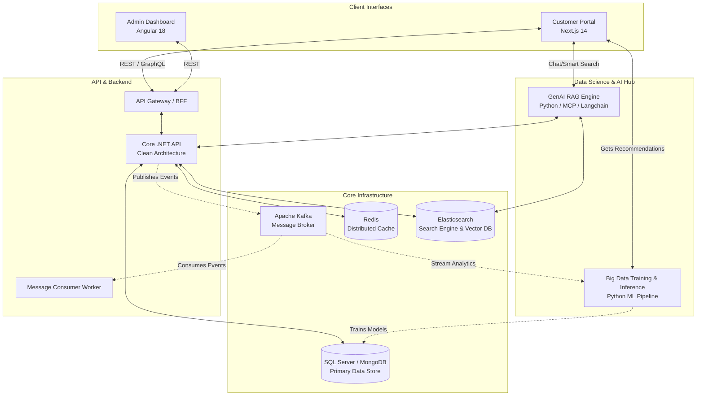
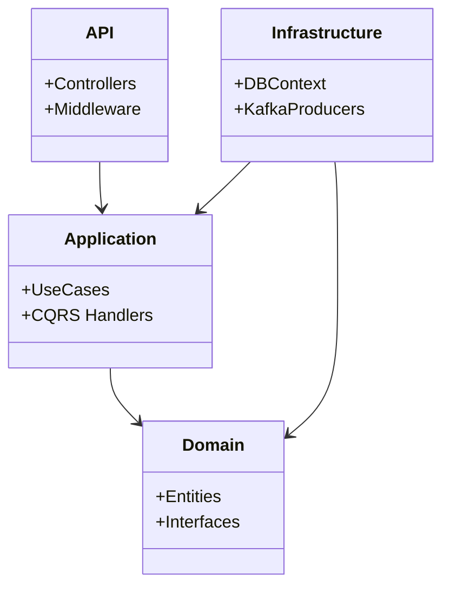
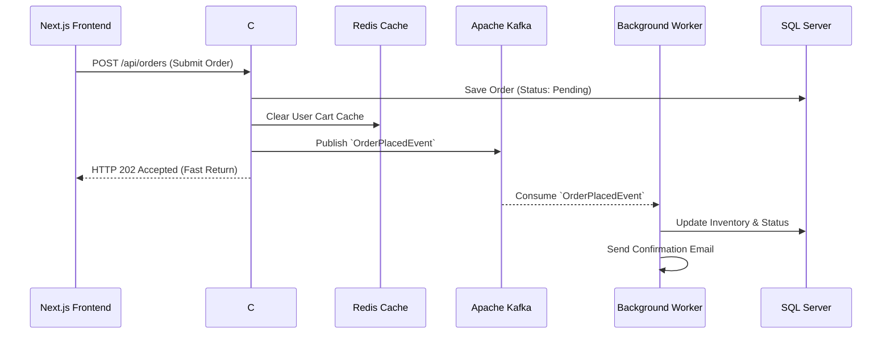
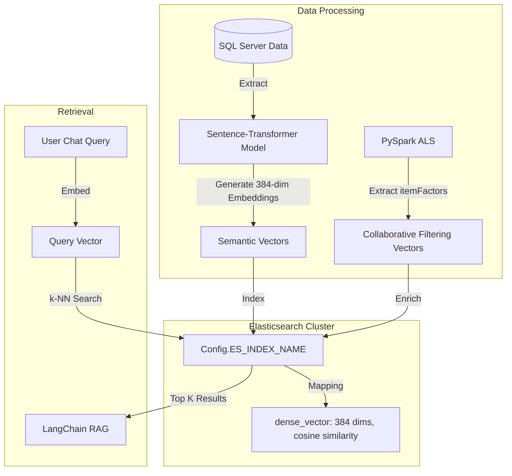
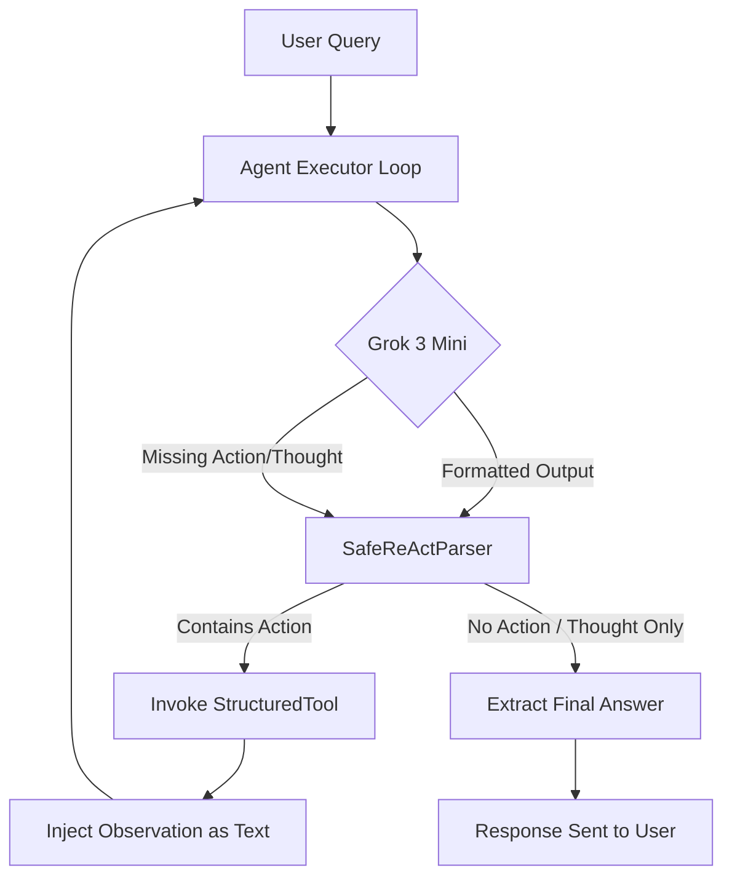
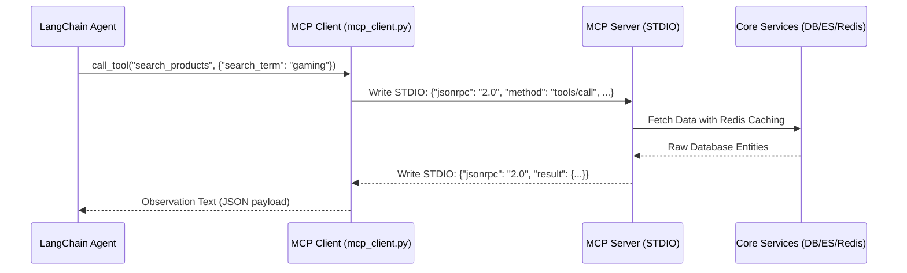
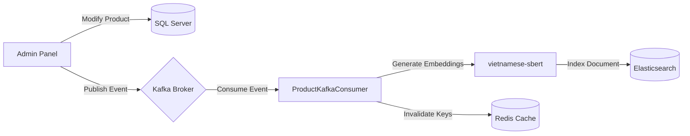
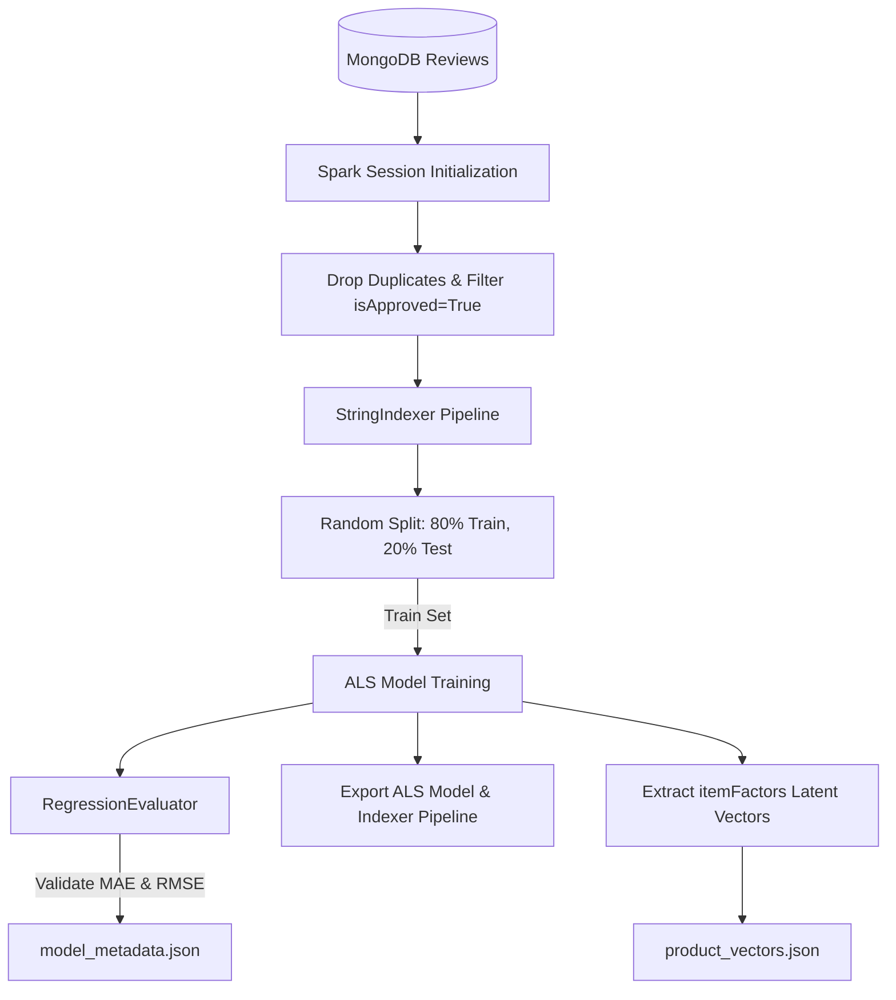
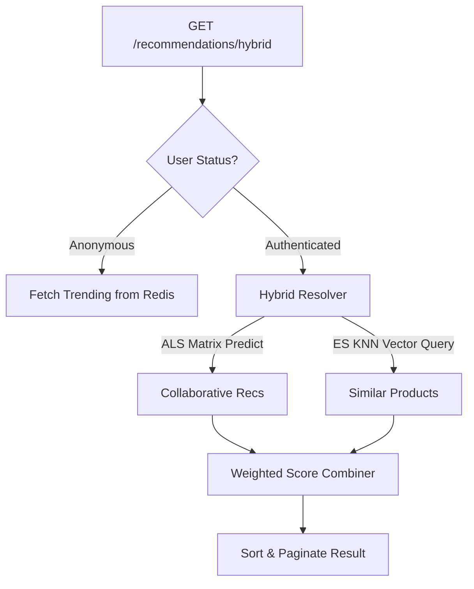
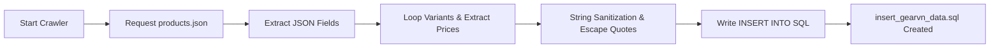

# VShop: Enterprise E-Commerce Platform with RAG & Big Data Analytics

Welcome to the **VShop E-Commerce System**, a fully modernized, highly scalable, and intelligent enterprise e-commerce platform. Designed from the ground up utilizing the **Microservices-inspired architecture**, **Clean Architecture** patterns, **Event-Driven Messaging**, **Big Data Analytics**, and **Generative AI Retrieval-Augmented Generation (RAG)**, this system is engineered to handle massive scale while delivering highly personalized user experiences.

This document serves as the primary entry point for developers, architects, and DevOps engineers looking to understand the project architecture, spin up the environment, and contribute to the codebase.

---

## 🌟 1. Executive Summary & Core Capabilities

VShop is not just a standard web store; it incorporates advanced enterprise techniques:

- **Intelligent Search & RAG**: Harnesses the power of Generative AI to provide natural language search, intelligent product summaries, and conversational AI features via a custom-built Model Context Protocol (MCP) RAG pipeline.
- **Big Data & Recommendations**: Features a dedicated Machine Learning and Big Data pipeline that tracks user events, crawls external data, trains models, and serves real-time personalized recommendations.
- **Event-Driven & Asynchronous**: Uses Apache Kafka to decouple services, enabling asynchronous background processing for emails, order processing, and analytics ingestion.
- **Dual Frontends**: A blazing fast, SEO-optimized Next.js frontend for customers, and a robust, feature-rich Angular 18 Single Page Application (SPA) for administrators.
- **Clean Architecture Backend**: Built on .NET Core, strictly separating Domain, Application, and Infrastructure layers.

---

## 🏗️ 2. High-Level System Architecture

The following diagram illustrates how the diverse components of VShop communicate with each other in a microservices ecosystem.



---

## 🧩 3. Subsystem Deep Dive

### 3.1 Customer Portal (`customer-fe`)
- **Technology**: Next.js 14 (App Router), React 18, TypeScript.
- **State & Data Fetching**: Redux Toolkit for global state, React Query (TanStack) for server state caching and synchronization.
- **Styling**: Chakra UI and TailwindCSS for rapid, responsive UI development.
- **Role**: Provides an SEO-optimized, highly responsive storefront. Handles user authentication (Google OAuth / Custom JWT), product browsing, cart management, and checkout flows.

### 3.2 Admin Dashboard (`admin-fe`)
- **Technology**: Angular 18, RxJS.
- **UI Toolkit**: PrimeNG, TailwindCSS, FontAwesome.
- **Features**: Includes rich-text editing (CKEditor 5), complex data tables, interactive charting (Highcharts), and form validations.
- **Role**: Empower store administrators to manage the product catalog, oversee orders, configure promotions, and monitor real-time sales analytics.

### 3.3 Core Backend API (`api-be`)
- **Technology**: ASP.NET Core (.NET 6/7/8).
- **Architecture**: Domain-Driven Design (DDD) & Clean Architecture.
- **Layers**:
  - `Domain`: Enterprise entities, value objects, and interfaces.
  - `Application`: CQRS Handlers, business logic, DTOs.
  - `Infrastructure`: Entity Framework Core, MongoDB Drivers, external integrations.
  - `API`: Controllers, Minimal APIs, Middleware, Auth.



### 3.4 Event-Driven Messaging & Caching (Apache Kafka & Redis)

#### 📨 Apache Kafka (KRaft Mode)
VShop utilizes Apache Kafka as the central nervous system for asynchronous communication, ensuring high throughput and fault tolerance. Configured in **KRaft mode** (eliminating the need for Zookeeper), Kafka manages several critical event streams:
- **`OrderPlacedEvent`**: When an order is created, the API publishes to this topic. A background worker consumes this to send confirmation emails and update inventory incrementally.
- **`ProductSyncEvent`**: Changes in the administrative dashboard trigger this topic. The Python `ProductContextKafkaConsumer` daemon listens to this and synchronizes the Elasticsearch vector database in real-time.
- **`UserTrackingEvent`**: Clicks and views from the Next.js frontend are pushed to Kafka, which streams into the Big Data pipeline for model retraining.

#### ⚡ Redis Distributed Cache
To guarantee sub-millisecond response times, VShop implements Redis for:
- **Cart & Session State**: Transient user cart data is stored in Redis to survive API restarts and reduce database I/O.
- **Hot-Path Caching**: Frequently accessed data, such as homepage categories and top 10 recommended products (pre-calculated by PySpark), are cached with a Time-To-Live (TTL).



### 3.5 Elasticsearch & Vector Database Architecture
Elasticsearch acts as the backbone for both the standard full-text search and the advanced Generative AI capabilities.
- **Standard Search**: Facilitates rapid fuzzy matching, faceted filtering (by price, category, brand), and typo-tolerance.
- **Vector Storage**: It stores the mathematical representations of products. The schema utilizes a `dense_vector` field configured for 384 dimensions.



---

## 🤖 4. Generative AI & Retrieval-Augmented Generation (`ecommerce-rag`)

VShop integrates a cutting-edge **Retrieval-Augmented Generation (RAG)** system designed as a conversational shopping assistant. Rather than relying on simple static Q&A search engines, this module implements an **Agentic Workflow** that dynamic schedules tools, queries database endpoints, interacts with customer shopping carts, and processes document repositories.

### 🧠 Agentic Architecture & LLM Orchestration
At the core of the RAG engine is **Grok 3 Mini Beta (via OpenRouter)**, chosen for its fast inference times and robust reasoning capabilities. The orchestration is handled via **LangChain** and a **ReAct (Reasoning and Acting)** framework that loops through user input, generates thoughts, selects tools, and parses observations.

#### Custom Output Parser (`SafeReActParser`)
Standard ReAct loops are susceptible to formatting failures when LLMs omit structural tokens like `Action:` or output raw conversation. VShop solves this with a custom `SafeReActParser`:
1. **Fallback Logic**: If the LLM omits the `Action:` keyword, the parser automatically treats the output as a `Final Answer`, preventing agent execution hangs.
2. **Text Cleaning**: It filters out redundant `Thought:` and `Final Answer:` markers using regex boundaries to clean up responses before displaying them to the end user.
3. **Pydantic Validation**: Converts unstructured JSON-like tool arguments from the LLM into typed Pydantic models (e.g. `AddToCartInput`, `SearchProductsInput`) to prevent run-time type exceptions.



### 🔌 Model Context Protocol (MCP) Integration
VShop features an implementation of the **Model Context Protocol (MCP)**, separating concerns by executing tools inside containerized, lightweight subprocesses communicating via standardized **JSON-RPC 2.0 over STDIO**.

1. **`product_server.py`**:
   - Exposes `get_products`, `search_products`, and `get_categories`.
   - Utilizes a local cache (Redis) with a 5-minute TTL before falling back to database query adapters.
2. **`document_server.py`**:
   - Exposes `search_documents` and `add_document_to_knowledge_base`.
   - Embeds unstructured store documents (e.g. shipping limits, returns policies, user guides) using the `paraphrase-multilingual-MiniLM-L12-v2` transformer model, and commits the dense vectors to Elasticsearch.
3. **`cart_server.py`**:
   - Exposes `add_product_to_cart` and `view_shopping_cart`.
   - Directs operations to the C# Backend (`api-be`) REST API endpoints by forwarding the user's JWT credentials, ensuring cart mutations are fully authorized.



### 🔍 Dual-Vector Elasticsearch Storage & Ingestion
VShop employs a dual-vector schema targeting two distinct search objectives:

| Feature | Embedding Model | Vector Dimensions | Similarity Metric | Use Case |
| :--- | :--- | :--- | :--- | :--- |
| **Semantic Search** | `vietnamese-sbert` | 768 | Cosine Similarity | Natural language search via customer frontend queries. |
| **Agentic RAG Search** | `paraphrase-multilingual-MiniLM-L12-v2` | 384 | Cosine Similarity | Contextual documentation retrieval and cross-lingual RAG tools. |

#### Real-Time Vector Synchronization Flow
To prevent vector store desynchronization when product attributes or inventories change, VShop implements an asynchronous ingestion daemon:
1. Core C# API writes changes to SQL Server and immediately pushes a `ProductSyncEvent` to **Apache Kafka** (`product-changes` topic).
2. The Python background service (`ProductKafkaConsumer` / `ProductContextKafkaConsumer`) polls the topic.
3. The consumer extracts product descriptors (`Name`, `Category`, `Features`, `Specifications`), generates new 768-dim embeddings using `vietnamese-sbert`, and updates the Elasticsearch `products` index.
4. It invalidates corresponding Redis caches (`product:detail:<id>` and `products:*`) to maintain system-wide state integrity.



---

## 📈 5. Big Data & Machine Learning Pipeline (`BigData_training`)

The machine learning and recommendation engine processes transactional and behavioral datasets, utilizing matrix factorization to generate personalized recommendations, and computing trending indicators based on real-time event tracking.

### 📐 Collaborative Filtering: ALS Matrix Factorization
The recommendation engine is built on **Apache Spark (PySpark)** and implements **Alternating Least Squares (ALS)** matrix factorization.

#### Mathematical Formulation
The algorithm maps users and items to a joint latent factor space of dimensionality $f$ (configured to $f = 25$ in VShop). The interaction between user $u$ and item $i$ is modeled by their inner product:
$$\hat{r}_{ui} = x_u^T y_i$$
where $x_u \in \mathbb{R}^{25}$ is the user factor vector, and $y_i \in \mathbb{R}^{25}$ is the item factor vector. The factors are learned by minimizing the regularized squared error loss function over all observed ratings:
$$\mathcal{L}(X, Y) = \sum_{u, i \in \mathcal{K}} (r_{ui} - x_u^T y_i)^2 + \lambda \left( \sum_u \|x_u\|_2^2 + \sum_i \|y_i\|_2^2 \right)$$
where:
* $\mathcal{K}$ is the set of user-item pairs for which ratings $r_{ui}$ are available (fetched from MongoDB `productReviews`).
* $\lambda$ is the regularization parameter (`regParam` set to `0.01` to prevent overfitting).
* The non-negativity constraint ($x_u \ge 0, y_i \ge 0$) is enforced to ensure the dimensions can be interpreted as positive preference components.



#### Preprocessing & Code Details
- **MongoDB Data Extraction**: Reviews are dynamically fetched where `isDeleted = False` and `isApproved = True`.
- **String Indexing**: PySpark cannot process arbitrary database string UUIDs/ObjectIDs for ALS matrix operations. We implement `StringIndexer` stages for both `userId` and `productId`. The mapping models are saved to `/models/indexer_model` to allow reverse mapping during real-time serving.
- **Evaluation**: The pipeline utilizes the `RegressionEvaluator` to measure prediction quality:
  $$\text{RMSE} = \sqrt{\frac{1}{|\mathcal{K}_{test}|} \sum_{u,i \in \mathcal{K}_{test}} (r_{ui} - \hat{r}_{ui})^2}$$
  Metadata including training times, RMSE, and MAE is written to `model_metadata.json`.
- **Factor Handoff**: The trained $y_i$ vectors (Item Factors) are parsed, mapped back to original database primary keys, and stored in `product_vectors.json` as a 25-dimensional float array per product, making them accessible to Content-Based vector search pipelines.

### ⚡ Hybrid Serving & Real-Time Inference
Recommendations are served via a high-performance Flask API in `recommendation_service.py` that merges collaborative preferences, similarity searches, and trending streams.



#### 1. Collaborative Filtering Prediction (ALS)
For authenticated users, the system maps the incoming request's `userId` through the pre-loaded Spark `indexer_model`. It executes:
```python
recs_df = als_model.recommendForUserSubset(user_subset_df, num_recs)
```
yielding the top collaborative product candidates.

#### 2. Content-Based KNN Retrieval
Using Elasticsearch's vector capability, the engine fetches products similar to the user's current browsing context or historical purchases. It performs a **K-Nearest Neighbors (k-NN)** search:
```json
{
  "knn": {
    "field": "embedding",
    "query_vector": [ ... ],
    "k": 10,
    "num_candidates": 50
  }
}
```

#### 3. Weighted Score Combination
The Hybrid recommendation engine combines the output of Collaborative ($S_{\text{collab}}$) and Content-Based ($S_{\text{content}}$) scores using a weighted linear combination:
$$\text{Score}_{\text{hybrid}}(p) = w_{\text{content}} \cdot S_{\text{content}}(p) + w_{\text{collab}} \cdot S_{\text{collab}}(p)$$
where $w_{\text{content}} = 0.6$ and $w_{\text{collab}} = 0.4$.

#### 4. Real-Time Tracking & Trending (Redis Sorted Sets)
User telemetry (clicks, shopping cart additions, checkouts) is written directly to Kafka and Redis, avoiding database locking. Redis tracks trending scores using weighted sorted sets:
$$\text{Trending Score}(p) = 0.3 \cdot \text{Views}(p) + 0.7 \cdot \text{Purchases}(p) + 0.5 \cdot \text{Likes}(p)$$
- **Views**: Incremented by 1 via `ZINCRBY trending:views 1 <productId>`.
- **Purchases**: Incremented by 3 via `ZINCRBY trending:purchases 3 <productId>`.
- **Likes**: Incremented by 2 via `ZINCRBY trending:likes 2 <productId>`.
Trending lists are computed instantly using `ZREVRANGE` across the combined scoring sets.

### 🕷️ GearVN Shopify JSON Web Crawler
VShop leverages `crawl_data.py` to seed the database with real retail datasets from GearVN:
- **Shopify Endpoint Traversal**: The crawler utilizes GearVN's public but hidden JSON API endpoints: `https://gearvn.com/collections/<collection-slug>/products.json?limit=250&page=<page_number>`. This bypasses complex HTML DOM parsing and ensures 100% accurate product data extraction (including titles, descriptions, variants, precise prices, tags, and image URLs).
- **Variant Processing**: The script loops through variants, calculating discount rates, inventory metrics, and structural parent-child configurations (separating base product specifications from selectable sizes/colors).
- **Batch SQL Generation**: Rather than writing records one by one, the crawler writes bulk insert operations directly into `insert_gearvn_data.sql`. It sanitizes product strings (escaping single quotes, cleaning HTML tags, and setting category hierarchies) for immediate database seeding.



---

## 💻 6. Technology Stack Matrix

| Layer | Technologies |
| :--- | :--- |
| **Customer Frontend** | Next.js 14, React 18, Redux Toolkit, React Query, Chakra UI, TailwindCSS |
| **Admin Frontend** | Angular 18, RxJS, PrimeNG, Highcharts, CKEditor 5 |
| **Backend API** | .NET 6/7/8, C#, Entity Framework Core, Clean Architecture |
| **Message Broker** | Apache Kafka (KRaft mode) |
| **Primary Database** | SQL Server (Relational) / MongoDB (NoSQL) |
| **Caching Layer** | Redis |
| **Search Engine & Vector DB** | Elasticsearch, Kibana |
| **Generative AI (RAG)** | Python, LangChain, MCP (Model Context Protocol) |
| **Big Data & ML** | Python, Scikit-learn/TensorFlow, Flask/FastAPI |
| **DevOps & Infra** | Docker, Docker Compose |

---

## 📂 7. Detailed Directory Structure

```text
VShop/
├── admin-fe/                           # Angular 18 Admin Portal
│   ├── src/app/                        # Routing, Pages, and Layouts
│   ├── src/core/                       # Interceptors, Guards, Auth Logic
│   ├── src/data/                       # HTTP API Services
│   ├── src/domain/                     # Interfaces and Models
│   └── package.json                    # Angular dependencies
│
├── api-be/                             # Backend Workspace
│   ├── api_be/                         # Web API Host (Controllers, Program.cs)
│   ├── Application/                    # MediatR handlers, validation rules
│   ├── Core/                           # Common utilities, exceptions
│   ├── Domain/                         # Aggregates, Entities, Events
│   ├── Infrastructure/                 # DB Contexts, Kafka Producers
│   │
│   ├── BigData_training/               # ML & Recommendation Engine Pipeline
│   │   ├── train_model.py              # ML Model training scripts
│   │   ├── recommendation_service.py   # Inference engine logic
│   │   └── app.py                      # Recommendation API server
│   │
│   ├── ecommerce-rag/                  # Generative AI RAG Implementation
│   │   ├── app.py                      # Main Chat/Search API
│   │   ├── mcp_client.py               # Model Context Protocol Client
│   │   └── setup_elasticsearch.py      # Vector DB Initialization
│   │
│   ├── docker-compose.yaml             # DBs, Redis, ES, Kibana setup
│   ├── docker-kafka.yaml               # KRaft Kafka setup
│   └── Insert_Sql.sql                  # Database Seed Scripts
│
└── customer-fe/                        # Next.js 14 Customer Storefront
    ├── src/app/                        # Server components & routes
    ├── src/components/                 # Reusable UI components
    ├── src/redux/                      # Redux state management
    ├── src/configs/                    # i18n, Axios interceptors
    └── package.json                    # Next.js dependencies
```

---

## 🚀 8. Setup & Installation Guide

Follow these steps to get the entire microservices ecosystem running locally.

### Prerequisites
1. **Node.js** (v18.x or higher)
2. **.NET SDK** (Matching the backend version, ideally .NET 8)
3. **Python 3.10+** (For Big Data and RAG modules)
4. **Docker & Docker Desktop** (crucial for Kafka, Redis, ES, SQL)

### Step 1: Spin up Core Infrastructure
Navigate to the backend directory and use Docker Compose to start the databases and Kafka.
```bash
cd api-be

# Start SQL Server, MongoDB, Redis, Elasticsearch, Kibana
docker-compose up -d

# Start Apache Kafka (Runs in KRaft mode, no Zookeeper needed)
docker-compose -f docker-kafka.yaml up -d
```
*Verify containers are healthy via Docker Desktop or `docker ps`.*

### Step 2: Initialize Database Data
You can seed the database using the provided `.sql` files:
```bash
# Example using SQLCMD or connect via SSMS to localhost:1433
# Execute Insert_Sql.sql and insert_gearvn_data.sql
```

### Step 3: Start the .NET Backend API
```bash
cd api-be
dotnet restore
dotnet run --project api_be/api_be.API.csproj
```
*Swagger UI will be available at `https://localhost:7152/swagger`.*

### Step 4: Start the Big Data & RAG Python Services (Optional)
Open a new terminal.
```bash
# For RAG
cd api-be/ecommerce-rag
pip install -r requirements.txt
python setup_elasticsearch.py
python app.py

# For Big Data Recommendation API
cd ../BigData_training
pip install -r requirements.txt
python train_model.py
python app.py
```

### Step 5: Start Customer Frontend (Next.js)
Open a new terminal.
```bash
cd customer-fe
npm install
npm run dev
```
*Access the storefront at `http://localhost:3000`.*

### Step 6: Start Admin Frontend (Angular)
Open a new terminal.
```bash
cd admin-fe
npm install
npm run start
```
*Access the admin dashboard at `http://localhost:4200`.*

---

## 🔧 9. Environment Configuration

### Frontend Configurations
- **Next.js**: Modify `customer-fe/.env.local`. Set your Google OAuth keys and API endpoint URLs.
- **Angular**: Modify `admin-fe/src/environments/environment.ts` for API URLs.

### Backend Configurations
- **.NET API**: Update `appsettings.json` and `appsettings.Development.json` with SQL connection strings, Redis endpoints, and Kafka bootstrap servers (`localhost:9092`).
- **Python Scripts**: Provide `.env` files in `ecommerce-rag` and `BigData_training` with Elasticsearch credentials and API keys for LLMs.

---

## 🤝 10. Contributing
1. Clone the repository and create your feature branch: `git checkout -b feature/amazing-feature`
2. Ensure you follow Clean Architecture guidelines for backend changes.
3. Write unit tests for Application layer handlers and Domain logic.
4. Push to the branch and open a Pull Request.

---

*Architected for scale. Designed for the future of e-commerce.*
*© 2026 VShop Project Team.*
