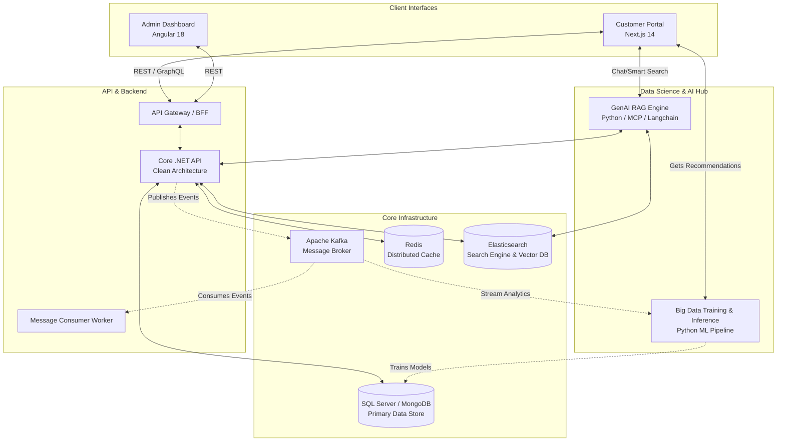
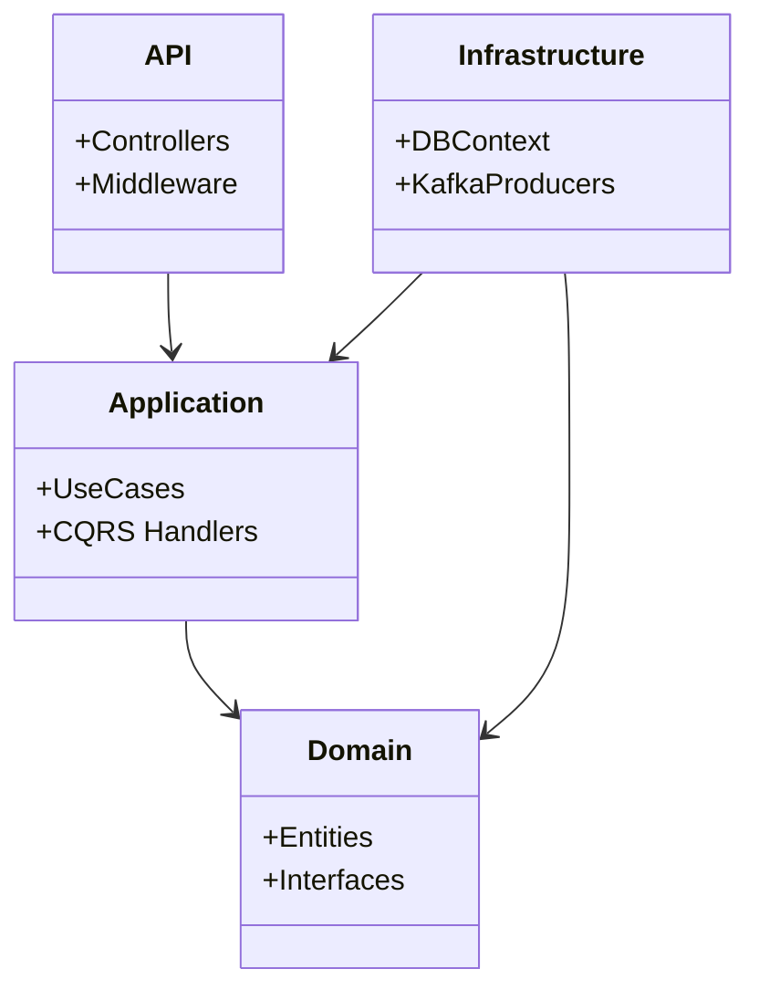
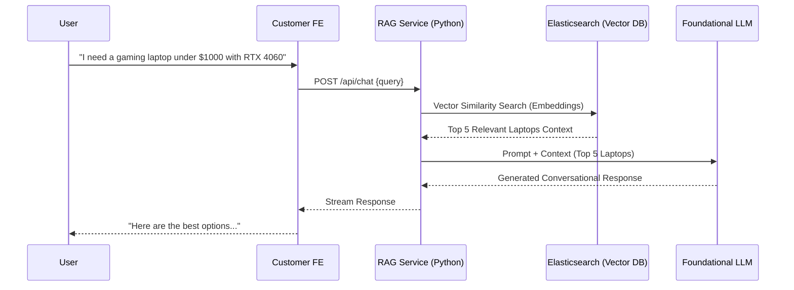
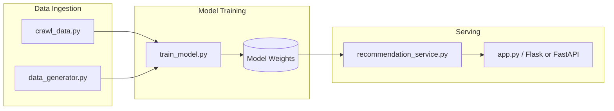

# VShop: Enterprise E-Commerce Platform with RAG & Big Data Analytics

Welcome to the **VShop E-Commerce System**, a fully modernized, highly scalable, and intelligent enterprise e-commerce platform. Designed from the ground up utilizing the **Microservices-inspired architecture**, **Clean Architecture** patterns, **Event-Driven Messaging**, **Big Data Analytics**, and **Generative AI Retrieval-Augmented Generation (RAG)**, this system is engineered to handle massive scale while delivering highly personalized user experiences.

This document serves as the primary entry point for developers, architects, and DevOps engineers looking to understand the project architecture, spin up the environment, and contribute to the codebase.

---

## 🌟 1. Executive Summary & Core Capabilities

VShop is not just a standard web store; it incorporates advanced enterprise techniques:

- **Intelligent Search & RAG**: Harnesses the power of Generative AI to provide natural language search, intelligent product summaries, and conversational AI features via a custom-built Model Context Protocol (MCP) RAG pipeline.
- **Big Data & Recommendations**: Features a dedicated Machine Learning and Big Data pipeline that tracks user events, crawls external data, trains models, and serves real-time personalized recommendations.
- **Event-Driven & Asynchronous**: Uses Apache Kafka to decouple services, enabling asynchronous background processing for emails, order processing, and analytics ingestion.
- **Dual Frontends**: A blazing fast, SEO-optimized Next.js frontend for customers, and a robust, feature-rich Angular 18 Single Page Application (SPA) for administrators.
- **Clean Architecture Backend**: Built on .NET Core, strictly separating Domain, Application, and Infrastructure layers.

---

## 🏗️ 2. High-Level System Architecture

The following diagram illustrates how the diverse components of VShop communicate with each other in a microservices ecosystem.



---

## 🧩 3. Subsystem Deep Dive

### 3.1 Customer Portal (`customer-fe`)
- **Technology**: Next.js 14 (App Router), React 18, TypeScript.
- **State & Data Fetching**: Redux Toolkit for global state, React Query (TanStack) for server state caching and synchronization.
- **Styling**: Chakra UI and TailwindCSS for rapid, responsive UI development.
- **Role**: Provides an SEO-optimized, highly responsive storefront. Handles user authentication (Google OAuth / Custom JWT), product browsing, cart management, and checkout flows.

### 3.2 Admin Dashboard (`admin-fe`)
- **Technology**: Angular 18, RxJS.
- **UI Toolkit**: PrimeNG, TailwindCSS, FontAwesome.
- **Features**: Includes rich-text editing (CKEditor 5), complex data tables, interactive charting (Highcharts), and form validations.
- **Role**: Empower store administrators to manage the product catalog, oversee orders, configure promotions, and monitor real-time sales analytics.

### 3.3 Core Backend API (`api-be`)
- **Technology**: ASP.NET Core (.NET 6/7/8).
- **Architecture**: Domain-Driven Design (DDD) & Clean Architecture.
- **Layers**:
  - `Domain`: Enterprise entities, value objects, and interfaces.
  - `Application`: CQRS Handlers, business logic, DTOs.
  - `Infrastructure`: Entity Framework Core, MongoDB Drivers, external integrations.
  - `API`: Controllers, Minimal APIs, Middleware, Auth.



### 3.4 Event-Driven Messaging (Apache Kafka)
- Configured natively using **KRaft mode** (removing Zookeeper dependency for lighter footprint).
- Used for loose coupling: When an order is placed, an event `OrderPlacedEvent` is pushed to Kafka. Background workers consume this to send emails, update inventory, and notify the Big Data pipeline.

### 3.5 Elasticsearch & Kibana
- Acts as the primary engine for full-text search across millions of SKUs.
- Facilitates rapid fuzzy matching and filtering.
- Kibana is included in the docker-compose stack for observability and data visualization.

---

## 🤖 4. Generative AI & Retrieval-Augmented Generation (`ecommerce-rag`)

VShop integrates a cutting-edge **RAG (Retrieval-Augmented Generation)** pipeline built with Python, **Flask**, and **SocketIO**. This module elevates the user experience by providing real-time, conversational commerce capabilities.

### 🧠 Deep Dive: RAG Architecture & MCP
- **LangChain & Agentic AI**: Driven by the **Gemini Pro (`gemini-pro`)** Foundational Model orchestrated via `langgraph`'s ReAct agent framework.
- **Model Context Protocol (MCP)**: Implements `mcp_client.py` connecting securely via STDIO to three specialized Python MCP servers:
  1. `product_server.py`: Tools for catalog retrieval (`get_products`, `search_products`).
  2. `document_server.py`: Tools for policy and documentation lookups (`search_documents`).
  3. `cart_server.py`: E-commerce operations (`add_to_cart`, `clear_cart`), directly proxying requests to the C# Backend.
- **Vector Database**: Connects to **Elasticsearch**, strictly mapping a `dense_vector` field of **384 dimensions** with `cosine` similarity, optimized for the `paraphrase-multilingual-MiniLM-L12-v2` embedding model (`setup_elasticsearch.py`).
- **Real-Time Data Sync**: Employs a background daemon (`ProductContextKafkaConsumer`) to continuously listen to Kafka topics, ensuring the RAG context remains up-to-date with backend inventory changes.



---

## 📈 5. Big Data & Machine Learning Pipeline (`BigData_training`)

To rival industry giants, VShop utilizes a custom-built Big Data and Machine Learning pipeline that analyzes user behavior and external data to generate highly accurate product recommendations.

### 📊 Deep Dive: ML Architecture
- **Data Ingestion (`crawl_data.py`)**: A robust web scraper (`GearVNToSQLCrawler`) designed to pull real-world product datasets (Laptops, PCs, Peripherals) from `gearvn.com`. It processes HTML, extracts technical specifications, handles pagination, and outputs a massive `insert_gearvn_data.sql` file to seed the SQL Server.
- **Collaborative Filtering Model (`train_model.py`)**: 
  - Utilizes **Apache Spark (PySpark)** to handle large-scale matrix operations.
  - Connects to MongoDB (`api_be_db.productReviews`) to ingest user rating data.
  - Trains an **Alternating Least Squares (ALS)** recommendation model (`pyspark.ml.recommendation.ALS`), tuned to calculate Root Mean Square Error (RMSE) and Mean Absolute Error (MAE).
  - Extracts the resulting `itemFactors` (product embeddings) and exports them to `product_vectors.json`.
- **Real-Time Inference (`recommendation_service.py`, `app.py`)**: Intercepts chat intents (e.g., when the RAG agent detects keywords like "gợi ý" or "recommend"). The Python Flask app merges RAG answers with real-time PySpark model inferences.



---

## 💻 6. Technology Stack Matrix

| Layer | Technologies |
| :--- | :--- |
| **Customer Frontend** | Next.js 14, React 18, Redux Toolkit, React Query, Chakra UI, TailwindCSS |
| **Admin Frontend** | Angular 18, RxJS, PrimeNG, Highcharts, CKEditor 5 |
| **Backend API** | .NET 6/7/8, C#, Entity Framework Core, Clean Architecture |
| **Message Broker** | Apache Kafka (KRaft mode) |
| **Primary Database** | SQL Server (Relational) / MongoDB (NoSQL) |
| **Caching Layer** | Redis |
| **Search Engine & Vector DB** | Elasticsearch, Kibana |
| **Generative AI (RAG)** | Python, LangChain, MCP (Model Context Protocol) |
| **Big Data & ML** | Python, Scikit-learn/TensorFlow, Flask/FastAPI |
| **DevOps & Infra** | Docker, Docker Compose |

---

## 📂 7. Detailed Directory Structure

```text
VShop/
├── admin-fe/                           # Angular 18 Admin Portal
│   ├── src/app/                        # Routing, Pages, and Layouts
│   ├── src/core/                       # Interceptors, Guards, Auth Logic
│   ├── src/data/                       # HTTP API Services
│   ├── src/domain/                     # Interfaces and Models
│   └── package.json                    # Angular dependencies
│
├── api-be/                             # Backend Workspace
│   ├── api_be/                         # Web API Host (Controllers, Program.cs)
│   ├── Application/                    # MediatR handlers, validation rules
│   ├── Core/                           # Common utilities, exceptions
│   ├── Domain/                         # Aggregates, Entities, Events
│   ├── Infrastructure/                 # DB Contexts, Kafka Producers
│   │
│   ├── BigData_training/               # ML & Recommendation Engine Pipeline
│   │   ├── train_model.py              # ML Model training scripts
│   │   ├── recommendation_service.py   # Inference engine logic
│   │   └── app.py                      # Recommendation API server
│   │
│   ├── ecommerce-rag/                  # Generative AI RAG Implementation
│   │   ├── app.py                      # Main Chat/Search API
│   │   ├── mcp_client.py               # Model Context Protocol Client
│   │   └── setup_elasticsearch.py      # Vector DB Initialization
│   │
│   ├── docker-compose.yaml             # DBs, Redis, ES, Kibana setup
│   ├── docker-kafka.yaml               # KRaft Kafka setup
│   └── Insert_Sql.sql                  # Database Seed Scripts
│
└── customer-fe/                        # Next.js 14 Customer Storefront
    ├── src/app/                        # Server components & routes
    ├── src/components/                 # Reusable UI components
    ├── src/redux/                      # Redux state management
    ├── src/configs/                    # i18n, Axios interceptors
    └── package.json                    # Next.js dependencies
```

---

## 🚀 8. Setup & Installation Guide

Follow these steps to get the entire microservices ecosystem running locally.

### Prerequisites
1. **Node.js** (v18.x or higher)
2. **.NET SDK** (Matching the backend version, ideally .NET 8)
3. **Python 3.10+** (For Big Data and RAG modules)
4. **Docker & Docker Desktop** (crucial for Kafka, Redis, ES, SQL)

### Step 1: Spin up Core Infrastructure
Navigate to the backend directory and use Docker Compose to start the databases and Kafka.
```bash
cd api-be

# Start SQL Server, MongoDB, Redis, Elasticsearch, Kibana
docker-compose up -d

# Start Apache Kafka (Runs in KRaft mode, no Zookeeper needed)
docker-compose -f docker-kafka.yaml up -d
```
*Verify containers are healthy via Docker Desktop or `docker ps`.*

### Step 2: Initialize Database Data
You can seed the database using the provided `.sql` files:
```bash
# Example using SQLCMD or connect via SSMS to localhost:1433
# Execute Insert_Sql.sql and insert_gearvn_data.sql
```

### Step 3: Start the .NET Backend API
```bash
cd api-be
dotnet restore
dotnet run --project api_be/api_be.API.csproj
```
*Swagger UI will be available at `https://localhost:7152/swagger`.*

### Step 4: Start the Big Data & RAG Python Services (Optional)
Open a new terminal.
```bash
# For RAG
cd api-be/ecommerce-rag
pip install -r requirements.txt
python setup_elasticsearch.py
python app.py

# For Big Data Recommendation API
cd ../BigData_training
pip install -r requirements.txt
python train_model.py
python app.py
```

### Step 5: Start Customer Frontend (Next.js)
Open a new terminal.
```bash
cd customer-fe
npm install
npm run dev
```
*Access the storefront at `http://localhost:3000`.*

### Step 6: Start Admin Frontend (Angular)
Open a new terminal.
```bash
cd admin-fe
npm install
npm run start
```
*Access the admin dashboard at `http://localhost:4200`.*

---

## 🔧 9. Environment Configuration

### Frontend Configurations
- **Next.js**: Modify `customer-fe/.env.local`. Set your Google OAuth keys and API endpoint URLs.
- **Angular**: Modify `admin-fe/src/environments/environment.ts` for API URLs.

### Backend Configurations
- **.NET API**: Update `appsettings.json` and `appsettings.Development.json` with SQL connection strings, Redis endpoints, and Kafka bootstrap servers (`localhost:9092`).
- **Python Scripts**: Provide `.env` files in `ecommerce-rag` and `BigData_training` with Elasticsearch credentials and API keys for LLMs.

---

## 🤝 10. Contributing
1. Clone the repository and create your feature branch: `git checkout -b feature/amazing-feature`
2. Ensure you follow Clean Architecture guidelines for backend changes.
3. Write unit tests for Application layer handlers and Domain logic.
4. Push to the branch and open a Pull Request.

---

*Architected for scale. Designed for the future of e-commerce.*
*© 2026 VShop Project Team.*
